# CookDating — Dating App Prototype

Throwaway prototype for a dating app built as a **.NET 10 modular monolith** following Domain-Driven Design, with a **React 19** single-page application and **AWS services** emulated locally via [floci](https://github.com/hectorvent/floci). Local orchestration is handled by **.NET Aspire**. The platform supports **multi-tenancy** — multiple themed instances (e.g. "Cook Dating", "Tech Dating") from a single deployment with full data and authentication isolation.

> **Status:** Prototype / proof-of-concept — not intended for production use.

---

## The Matching Journey

A visual walkthrough of the full user experience — from signing up to chatting with a match.

### 1. Authentication

<p float="left">
  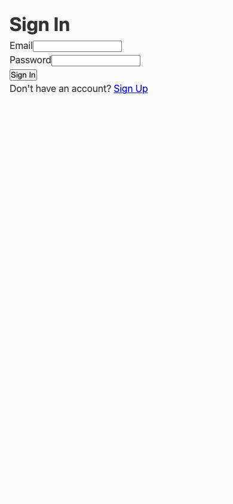
  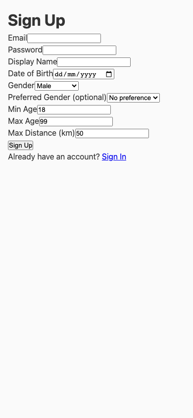
  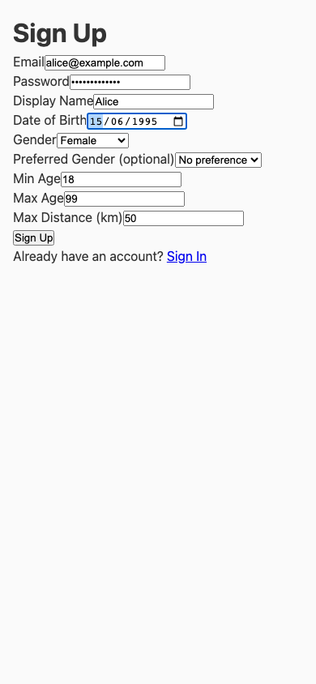
</p>

Users register with an email, password, display name, date of birth, gender, and dating preferences (preferred gender, age range, maximum distance). Authentication is handled by **Amazon Cognito** (emulated via floci).

### 2. Profile & Looking Status

<p float="left">
  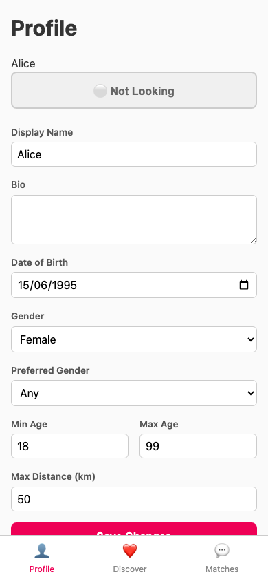
  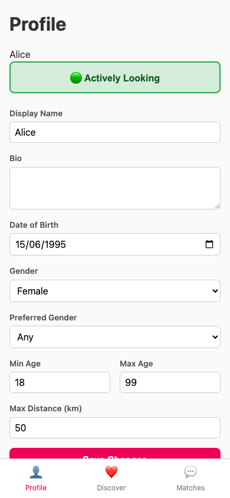
</p>

After signing up, users land on their **Profile** page. The looking status toggle controls whether you appear in other users' discover feeds. Changing it publishes a `LookingStatusChanged` domain event via SNS → SQS to the Matching Worker, which activates or deactivates the user in the candidate pool.

### 3. Discovering Candidates

<p float="left">
  
  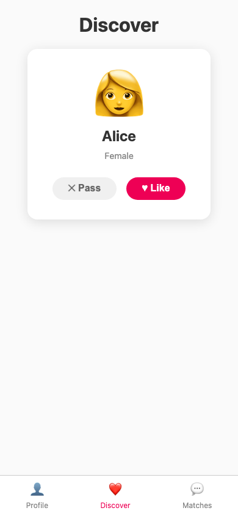
  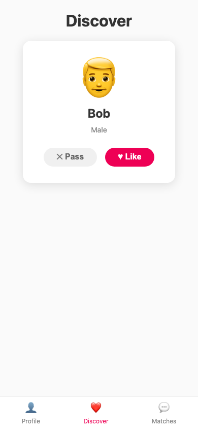
</p>

The **Discover** tab connects to the `MatchingHub` via SignalR. Candidates are loaded from DynamoDB, filtered to exclude users you've already swiped on. Each card shows the candidate's name, gender, and **Pass** / **Like** buttons.

### 4. Matching

<p float="left">
  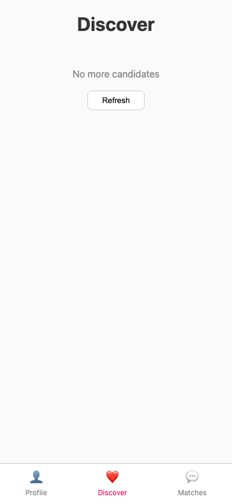
  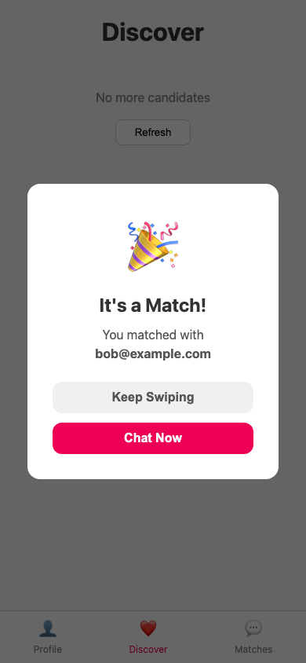
</p>

When you swipe **Like** on someone who has already liked you, a **match** is created. The domain detects the mutual like, raises a `MatchCreated` event, and the BFF pushes an **"It's a Match!"** modal to both users in real-time via SignalR. A conversation is created immediately so the matched pair can start chatting.

### 5. Matches List & Chat

<p float="left">
  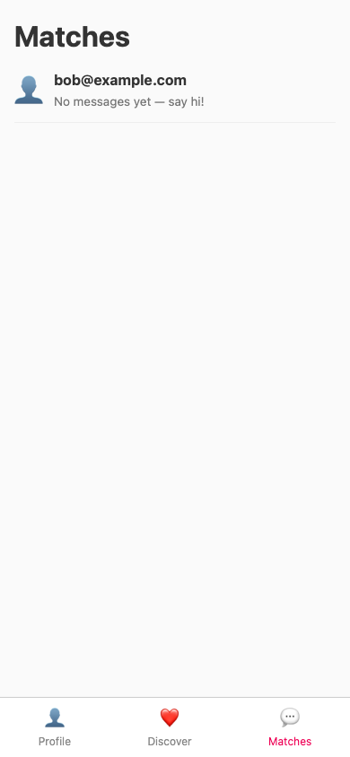
  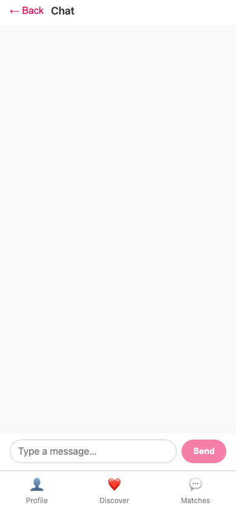
</p>

The **Matches** tab lists all conversations. Tapping a match opens the chat view, which connects to the `ConversationHub` via SignalR.

### 6. Messaging

<p float="left">
  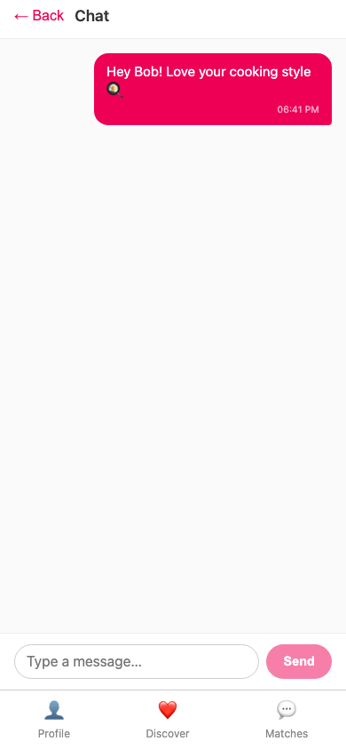
  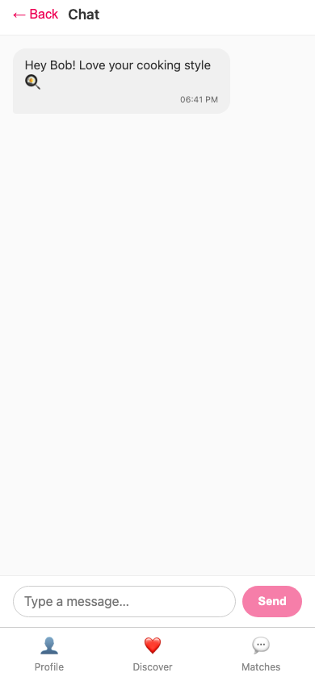
  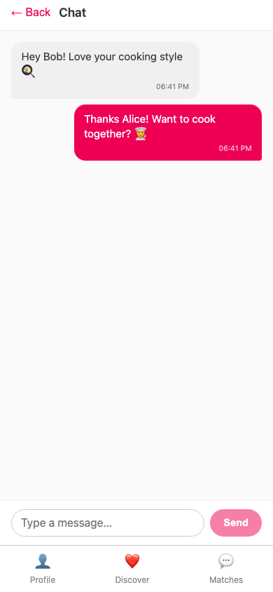
</p>

Messages are sent and received in **real-time** via SignalR WebSockets. The domain enforces that only match participants can send messages, and message content is capped at 2,000 characters.

---

## Architecture

```
┌─────────────────────────────────────────────────────────────────┐
│                   React SPA (per-tenant)                        │
│               Discover · Matches · Chat · Profile               │
│                 Shows tenant name in header                     │
└──────────────┬──────────────────────────┬───────────────────────┘
        REST / │                          │ WebSocket
        HTTP   │                          │ (SignalR)
               ▼                          ▼
┌──────────────────────────────────────────────────────────────────┐
│                BFF — ASP.NET Web API (per-tenant)                │
│         REST controllers · SignalR hubs (Matching, Chat)         │
│        TenantContextMiddleware sets ITenantContext per request   │
└──────┬──────────────┬───────────────────┬───────────────────────┘
       │              │                   │
       ▼              ▼                   ▼
  ┌──────────┐  ┌───────────┐  ┌────────────────┐
  │ Profile  │  │ Matching  │  │ Conversation   │
  │ Context  │  │ Context   │  │ Context        │
  └────┬─────┘  └─────┬─────┘  └───────┬────────┘
       │              │                 │
       ▼              ▼                 ▼
┌──────────────────────────────────────────────────────────────────┐
│                   AWS (floci emulator — shared)                  │
│    DynamoDB (TenantId attr) · SNS · SQS · Cognito (per-tenant)  │
└──────────────────────────────────────────────────────────────────┘
       ▲              ▲
       │              │
  ┌────┴─────┐  ┌─────┴──────────┐
  │ Matching │  │ Conversation   │
  │ Worker   │  │ Worker         │  ← shared — extracts TenantId per message
  └──────────┘  └────────────────┘
```

The system is organised as a **modular monolith** with three bounded contexts that communicate through domain events published over **SNS → SQS**. The **BFF** acts purely as an integration / anti-corruption layer — it translates between the React SPA and domain libraries but holds no domain logic of its own.

---

## Tech Stack

| Layer | Technology |
|---|---|
| Frontend | React 19, TypeScript 5.9, Vite 8, React Router 7 |
| Real-time | SignalR (WebSockets) |
| Backend API | ASP.NET Core (.NET 10) |
| Domain libraries | C# / .NET 10 — DDD building blocks |
| Persistence | Amazon DynamoDB (via floci) |
| Messaging | Amazon SNS / SQS (via floci) |
| Authentication | Amazon Cognito (via floci) |
| Containerisation | Docker (multi-stage builds) |
| Orchestration | .NET Aspire 13.2.1 |
| Logging | `[LoggerMessage]` source-generated structured logging |
| Unit tests | NUnit 4 |
| BDD / E2E tests | Reqnroll 3 (Gherkin) + Playwright |
| CI | GitHub Actions |

---

## Prerequisites

| Requirement | Version |
|---|---|
| [.NET SDK](https://dotnet.microsoft.com/download) | 10.0 |
| [Node.js](https://nodejs.org/) | 22+ |
| [Docker Desktop](https://www.docker.com/products/docker-desktop/) | Latest |

Docker is required to run the **floci** container that emulates AWS services. It is also used to build container images for CI and optional container-mode testing.

---

## Getting Started

```bash
# Clone the repository
git clone https://github.com/<your-org>/throwaway-cook-dating.git
cd throwaway-cook-dating

# Install client dependencies
cd src/client-app && npm install && cd ../..

# Run with Aspire
dotnet run --project src/CookDating.AppHost
```

Aspire will orchestrate the full stack automatically:

| Resource | Description |
|---|---|
| `floci` | AWS emulator container (DynamoDB, SNS, SQS, Cognito) on port `4566` |
| `{tenantId}-bff` | Per-tenant ASP.NET Core backend — REST API + SignalR hubs (e.g. `cook-dating-bff`) |
| `{tenantId}-client` | Per-tenant React client (e.g. `cook-dating-client`) |
| `matching-worker` | Shared background service consuming SQS messages for match processing |
| `conversation-worker` | Shared background service consuming SQS messages for chat processing |

By default, a single tenant (`cook-dating`) is configured. To add more tenants, set the `Tenants` array in `src/CookDating.AppHost/appsettings.json`:

```json
{
  "Tenants": ["cook-dating", "tech-dating"]
}
```

Open the **Aspire dashboard** (URL printed to console on startup) to monitor all resources, view structured logs, and inspect traces.

### Container Mode

For CI or to test with pre-built Docker images instead of local project references:

```bash
# Build all container images
docker build -t cookdating-bff -f src/CookDating.Bff/Dockerfile .
docker build -t cookdating-matching-worker -f src/CookDating.Matching.Worker/Dockerfile .
docker build -t cookdating-conversation-worker -f src/CookDating.Conversation.Worker/Dockerfile .
docker build -t cookdating-client-app -f src/client-app/Dockerfile src/client-app

# Run Aspire in container mode
USE_CONTAINER_IMAGES=true dotnet run --project src/CookDating.AppHost
```

When `USE_CONTAINER_IMAGES=true`, Aspire uses `AddContainer()` with the pre-built images instead of `AddProject()`. This is the mode used by CI and ensures the BDD tests exercise the actual container images.

---

## Project Structure

```
throwaway-cook-dating/
├── src/
│   ├── CookDating.AppHost/             # .NET Aspire orchestrator
│   ├── CookDating.ServiceDefaults/     # Shared Aspire service configuration
│   ├── CookDating.SharedKernel/        # DDD building blocks & AWS infrastructure
│   │   ├── Domain/                     #   Entity, AggregateRoot, ValueObject, IDomainEvent
│   │   └── Infrastructure/             #   DynamoDB repos, SNS publisher, SQS consumer, ITenantContext
│   ├── CookDating.Profile/             # Profile bounded context
│   │   ├── Domain/                     #   UserProfile, DatingPreferences, Gender, LookingStatus
│   │   ├── Application/                #   Commands + handlers
│   │   └── Infrastructure/             #   DynamoDbProfileRepository
│   ├── CookDating.Matching/            # Matching bounded context
│   │   ├── Domain/                     #   MatchCandidate, Swipe, Match, SwipeDirection
│   │   ├── Application/                #   Commands + handlers
│   │   └── Infrastructure/             #   DynamoDbMatchCandidateRepository, DynamoDbMatchRepository
│   ├── CookDating.Conversation/        # Conversation bounded context
│   │   ├── Domain/                     #   Conversation, Message
│   │   ├── Application/                #   Commands + handlers
│   │   └── Infrastructure/             #   DynamoDbConversationRepository
│   ├── CookDating.Bff/                 # Backend-for-Frontend
│   │   ├── Controllers/                #   AuthController, ProfileController
│   │   ├── Handlers/                   #   SignUpHandler (reservation pattern orchestration)
│   │   ├── Hubs/                       #   MatchingHub, ConversationHub (SignalR)
│   │   ├── Dtos/                       #   Request/response DTOs
│   │   └── Infrastructure/             #   Middleware, Cognito settings, TenantContextMiddleware, PrototypeTokenHelper
│   ├── CookDating.Matching.Worker/     # SQS consumer: profile-events → matching-queue
│   ├── CookDating.Conversation.Worker/ # SQS consumer: matching-events → conversation-queue
│   └── client-app/                     # React SPA
│       └── src/
│           ├── components/             #   SwipeCard, ChatBubble, MatchListItem, etc.
│           ├── hooks/                  #   useAuth, useConversationHub, useMatchingHub, useTenant
│           ├── pages/                  #   DiscoverTab, MatchesTab, ChatView, ProfileTab
│           └── services/              #   REST API client, SignalR connection
├── tests/
│   ├── CookDating.UnitTests/           # NUnit domain model tests
│   └── CookDating.BddTests/           # Reqnroll + Playwright E2E tests
│       ├── Features/                   #   Gherkin feature files
│       ├── StepDefinitions/            #   Step bindings
│       ├── Hooks/                      #   AspireHook, LogWatcherHook
│       └── Support/                    #   LogCollector (resource log monitoring)
├── docs/screenshots/                   # App screenshots for this README
└── .github/workflows/ci.yml           # CI pipeline
```

---

## Bounded Contexts

### Profile

Manages user registration, profile editing, dating preferences, and looking status.

**Domain model:** `UserProfile` (aggregate root) with `DatingPreferences` (value object).

**Publishes:**
- `ProfileCreated` — when a new user signs up
- `LookingStatusChanged` — when a user toggles actively looking on/off

**Validation rules:** Users must be 18–120 years old, date of birth cannot be in the future, display name is required, age range min ≥ 18, max distance > 0.

### Matching

Maintains a candidate pool, records swipes, and detects mutual likes.

**Domain model:** `MatchCandidate` (aggregate root) containing `Swipe` value objects, and `Match` (aggregate root).

**Consumes:** `ProfileCreated`, `LookingStatusChanged` (from Profile context via SQS)

**Publishes:**
- `SwipeRecorded` — on every swipe
- `MatchCreated` — when a mutual like is detected

**Key invariants:** Cannot swipe on yourself, cannot swipe on the same user twice, inactive candidates don't appear in the discover feed.

### Conversation

Real-time chat between matched users. **Chat is gated on match status** — the domain enforces that a conversation can only be started between users who have an active match.

**Domain model:** `Conversation` (aggregate root) containing `Message` entities.

**Consumes:** `MatchCreated` (from Matching context via SQS)

**Key invariants:** Only match participants can send messages, message content max 2,000 characters, only participants can read messages.

---

## Commands & Queries

All application logic flows through command handlers. The BFF translates HTTP/SignalR requests into commands, dispatches them to the appropriate handler, and returns the result.

### Profile Commands

| Command | Trigger | What it does | Events raised |
|---|---|---|---|
| `CreateProfileCommand` | `POST /api/auth/signup` | Creates a `UserProfile` aggregate, persists to DynamoDB | `ProfileCreated` |
| `UpdateProfileCommand` | `PUT /api/profile` | Updates name, bio, photos, date of birth, gender, and/or dating preferences | — |
| `SetLookingStatusCommand` | `PUT /api/profile/status` | Toggles between `ActivelyLooking` and `NotLooking` | `LookingStatusChanged` |

### Matching Commands

| Command | Trigger | What it does | Events raised |
|---|---|---|---|
| `GetCandidatesCommand` | `MatchingHub.GetCandidates()` | Returns active candidates the user hasn't swiped on yet | — |
| `SwipeCommand` | `MatchingHub.Swipe()` | Records a swipe (left/right). If mutual like → creates `Match` | `SwipeRecorded`, `MatchCreated` (if mutual) |
| `ProcessProfileCreatedCommand` | Matching Worker (SQS) | Creates a `MatchCandidate` entry from a `ProfileCreated` event | — |
| `ProcessLookingStatusCommand` | Matching Worker (SQS) | Activates/deactivates a candidate based on looking status | — |

### Conversation Commands

| Command | Trigger | What it does | Events raised |
|---|---|---|---|
| `StartConversationCommand` | BFF (on match) + Conversation Worker (SQS) | Creates a `Conversation` for a match | `ConversationStarted` |
| `GetConversationsCommand` | `ConversationHub.GetConversations()` | Lists all conversations for a user | — |
| `GetConversationCommand` | `ConversationHub.JoinConversation()` | Loads a single conversation (with auth check) | — |
| `SendMessageCommand` | `ConversationHub.SendMessage()` | Adds a message to the conversation | `MessageSent` |
| `MarkMessagesReadCommand` | `ConversationHub.MarkRead()` | Marks incoming messages as read | — |

---

## BFF Endpoints & Hubs

The BFF is a thin integration layer — it maps HTTP requests and SignalR messages to domain commands and returns results. It holds **no domain logic**.

### REST Controllers

#### `AuthController` — `/api/auth`

| Method | Route | Description |
|---|---|---|
| `POST` | `/api/auth/signup` | Reserve user in Cognito, create & validate profile, confirm Cognito reservation, sync candidate to matching (see [Reservation Pattern](#reservation-pattern)) |
| `POST` | `/api/auth/signin` | Authenticate with Cognito, return JWT (falls back to prototype token if Cognito is unavailable) |

#### `ProfileController` — `/api/profile` (requires auth)

| Method | Route | Description |
|---|---|---|
| `GET` | `/api/profile` | Fetch current user's profile |
| `PUT` | `/api/profile` | Update profile details (name, bio, DOB, gender, preferences) |
| `PUT` | `/api/profile/status` | Toggle looking status (`ActivelyLooking` ↔ `NotLooking`) |

#### `ConfigController` — `/api/config`

| Method | Route | Description |
|---|---|---|
| `GET` | `/api/config` | Returns tenant configuration (`tenantId`, `tenantName`) for the React SPA |

### SignalR Hubs

#### `MatchingHub` — `/hubs/matching` (requires auth)

| Method | Parameters | Description | Client callback |
|---|---|---|---|
| `GetCandidates` | — | Load swipeable candidates | `ReceiveCandidates` |
| `Swipe` | `{ TargetUserId, Direction }` | Record swipe; detect match; create conversation | `MatchFound` (sent to both users) |

#### `ConversationHub` — `/hubs/conversation` (requires auth)

| Method | Parameters | Description | Client callback |
|---|---|---|---|
| `GetConversations` | — | List all conversations | `ReceiveConversations` |
| `JoinConversation` | `conversationId` | Load messages, join SignalR group | `ReceiveMessages` |
| `LeaveConversation` | `conversationId` | Leave SignalR group | — |
| `SendMessage` | `conversationId, content` | Send message (broadcast to group) | `ReceiveMessage` |
| `MarkRead` | `conversationId` | Mark messages as read | — |

---

## Reservation Pattern

The sign-up flow uses a **reservation pattern** to prevent orphaned Cognito users when domain validation fails (e.g. invalid date of birth). This is orchestrated by `SignUpHandler`:

```
1. Reserve Cognito user        — SignUp creates an unconfirmed account
2. Create profile (domain)     — UserProfile.Create validates DOB, preferences, etc.
3. Confirm Cognito reservation — AdminConfirmSignUp activates the account
4. Sync matching candidate     — ProcessProfileCreatedCommand adds user to candidate pool
5. Return access token
```

If **step 2 fails** (e.g. user is under 18), the Cognito reservation is left unconfirmed and no profile is created. On **retry**, the handler detects the existing Cognito user, checks that no profile exists (confirming it's just a reservation), deletes the stale reservation, and starts fresh — so the user can correct their input and complete sign-up without hitting an "email already registered" error.

If a **confirmed profile already exists** for the email, the handler throws `EmailAlreadyRegisteredException` (409 Conflict).

---

## Domain Events & Messaging

Events flow between bounded contexts via **SNS → SQS**:

```
Profile Context                              Matching Context                         Conversation Context
──────────────                               ────────────────                         ────────────────────

 ProfileCreated ───┐                                                                  
                   ├──→ SNS: profile-events ──→ SQS: matching-queue ──→ Matching Worker
LookingStatusChanged┘        │                        │
                             │               ProcessProfileCreatedCommand
                             │               ProcessLookingStatusCommand
                             │
                             │                SwipeRecorded ───┐
                             │                                 ├──→ SNS: matching-events ──→ SQS: conversation-queue ──→ Conversation Worker
                             │                MatchCreated ────┘                                       │
                             │                                                            StartConversationCommand
```

### SNS Topics

| Topic | Published by | Events |
|---|---|---|
| `profile-events` | Profile command handlers | `ProfileCreated`, `LookingStatusChanged` |
| `matching-events` | Matching command handlers | `SwipeRecorded`, `MatchCreated` |

### SQS Queues

| Queue | Subscribed to | Consumer | Processes |
|---|---|---|---|
| `matching-queue` | `profile-events` | `MatchingEventConsumer` (Matching Worker) | Creates/activates/deactivates match candidates |
| `conversation-queue` | `matching-events` | `ConversationEventConsumer` (Conversation Worker) | Creates conversations for new matches |

---

## AWS Infrastructure (DynamoDB)

All persistence uses DynamoDB tables, bootstrapped automatically when the app starts. Every item includes a `TenantId` attribute for multi-tenant isolation, transparently managed by the `DynamoDbRepository` base class.

| Table | Primary Key | GSIs | Stores |
|---|---|---|---|
| `Profiles` | `UserId` (S) | — | `UserProfile` aggregates |
| `MatchCandidates` | `UserId` (S) | — | `MatchCandidate` aggregates (includes embedded swipes) |
| `Matches` | `MatchId` (S) | `User1Id-index`, `User2Id-index` | `Match` aggregates |
| `Conversations` | `ConversationId` (S) | `MatchIdIndex`, `Participant1IdIndex`, `Participant2IdIndex` | `Conversation` aggregates (includes embedded messages) |

---

## Running Tests

```bash
# Unit tests (domain model + handler tests)
dotnet test tests/CookDating.UnitTests/

# BDD E2E tests — project mode (requires Docker for floci; runs .NET projects directly)
dotnet test tests/CookDating.BddTests/

# BDD E2E tests — container mode (requires all Docker images to be built first)
USE_CONTAINER_IMAGES=true dotnet test tests/CookDating.BddTests/
```

### Unit Tests

NUnit tests covering domain invariants across all three bounded contexts — profile validation, swipe rules, match detection, message constraints — plus handler tests for the sign-up reservation pattern (`SignUpHandlerTests`) and multi-tenancy infrastructure tests (tenant context middleware, config controller, DynamoDB tenant isolation, SNS tenant propagation).

### BDD Tests

Reqnroll (Gherkin) feature files exercised end-to-end with Playwright against a real Aspire-hosted stack:

| Feature file | Covers |
|---|---|
| `SignUp.feature` | User registration flow, DOB validation retry (reservation pattern) |
| `Profile.feature` | Profile editing, looking status toggle, preferences, gender reset |
| `Swiping.feature` | Swipe interactions |
| `Matching.feature` | Mutual like → match creation |
| `Conversation.feature` | Chat between matched users |
| `TenantIsolation.feature` | Cross-tenant auth rejected, cross-tenant candidate isolation |

### Log Watcher

BDD tests include a **log watcher hook** that monitors Aspire resource logs (per-tenant BFFs, Matching Worker, Conversation Worker) during each scenario. If any unexpected error-level logs are detected, the scenario is automatically failed. Known expected warnings (Cognito emulator fallbacks, etc.) are allowlisted in `LogCollector.cs`.

---

## Structured Logging

All services use .NET's `[LoggerMessage]` source-generated structured logging with named event IDs for efficient, zero-allocation log output. Every HTTP request is enriched with a `UserId` scope via `UserIdLoggingScopeMiddleware`, making it easy to trace a user's journey through the Aspire dashboard.

---

## CI Pipeline

The GitHub Actions workflow (`.github/workflows/ci.yml`) runs on every **push to `main`** and **pull request targeting `main`**:

1. Start a **floci** service container (AWS emulator)
2. Set up .NET 10 SDK and Node.js 22
3. Install client dependencies and build the React app
4. Lint the React app (`eslint .`)
5. Restore and build the .NET solution
6. Run **unit tests** (NUnit)
7. **Build Docker images** for all four services (BFF, Matching Worker, Conversation Worker, client-app)
8. Install Playwright browsers (Chromium)
9. Run **BDD E2E tests** in container mode (`USE_CONTAINER_IMAGES=true`) against the built images
10. Upload test result artifacts (`.trx` files)

---

## Key Design Decisions

| Decision | Rationale |
|---|---|
| **Multi-tenancy with shared infrastructure** | Single floci instance with `TenantId` attribute on all DynamoDB items. Per-tenant Cognito user pools provide auth isolation. Per-tenant BFF + client instances, single shared worker pair that extracts TenantId per message. Domain models stay clean — no TenantId in domain layer. |
| **BFF as integration layer, not a bounded context** | The BFF only translates between the SPA and domain libraries — it holds no domain logic of its own. |
| **Reservation pattern for sign-up** | Cognito user is created as a reservation first. Domain validation (age, preferences) runs before confirming. If validation fails, the reservation can be reclaimed on retry — preventing orphaned Cognito accounts with invalid data. |
| **Dockerised services with conditional Aspire mode** | Each service has a multi-stage Dockerfile. Aspire switches between `AddProject` (local dev) and `AddContainer` (CI / container mode) via `USE_CONTAINER_IMAGES` env var, so BDD tests exercise the actual container images. |
| **No infrastructure dependencies in domain layers** | Domain projects (Profile, Matching, Conversation) have zero NuGet dependencies — pure C# with DDD building blocks from SharedKernel. |
| **Reqnroll instead of SpecFlow** | SpecFlow does not support .NET 10. Reqnroll is its community-driven successor with full .NET 10 compatibility. |
| **floci instead of LocalStack** | floci is free and requires no authentication tokens, making local development and CI simpler. |
| **Chat gated on match status** | Enforced at the domain level — `Conversation` can only be created when a valid `Match` exists between both users. |
| **SignalR for real-time** | Provides WebSocket transport for live match notifications and chat messaging with minimal client setup. |
| **Modular monolith** | Keeps deployment simple for a prototype while maintaining clear bounded-context boundaries that could be split into separate services later. |
| **`[LoggerMessage]` source generation** | Zero-allocation structured logging with named event IDs for efficient diagnostics on Aspire. |

---

## Multi-Tenancy

The platform supports multiple themed tenants from a single deployment. Each tenant has its own branding, authentication, and data isolation.

### How It Works

| Layer | Isolation Strategy |
|---|---|
| **Authentication** | Per-tenant Cognito user pool (`{tenantId}-pool`) — a user registered on Cook Dating cannot sign in on Tech Dating |
| **Data** | `TenantId` attribute on every DynamoDB item — the `DynamoDbRepository` base class transparently adds it on save, verifies on get, and filters on query |
| **Events** | `TenantId` propagated as an SNS message attribute — workers extract it per message and set it on the scoped `ITenantContext` |
| **BFF** | Per-tenant instances with `TENANT_ID` env var — `TenantContextMiddleware` sets the scoped `ITenantContext` on every request |
| **Client** | Per-tenant React apps — fetch tenant config from `GET /api/config` and display tenant name in header |
| **Workers** | Shared single pair — process messages for all tenants, extracting `TenantId` from each message |

### Configuration

Tenants are defined in `src/CookDating.AppHost/appsettings.json`:

```json
{
  "Tenants": ["cook-dating", "tech-dating"]
}
```

Aspire dynamically creates per-tenant BFF + client resources. Resource names follow the pattern `{tenantId}-bff` and `{tenantId}-client`.

### ITenantContext Flow

```
BFF Request Flow:
  HTTP Request → TenantContextMiddleware (reads TENANT_ID env var)
               → sets scoped ITenantContext.TenantId
               → Repositories auto-add/filter TenantId
               → SnsEventPublisher includes TenantId in message attributes

Worker Message Flow:
  SQS Message → SqsMessageConsumer extracts TenantId from SNS envelope
              → Consumer sets scoped ITenantContext.TenantId
              → Handlers use tenant-aware repositories
```

### Screenshots

Each tenant gets its own branding and isolated data:

| Cook Dating | Tech Dating |
|---|---|
| 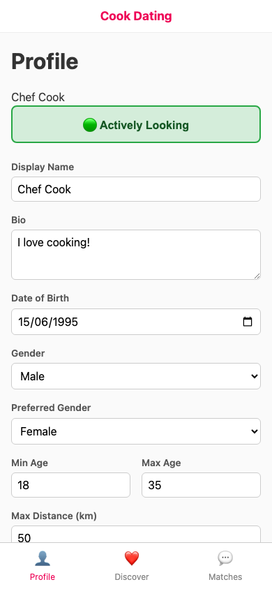 | 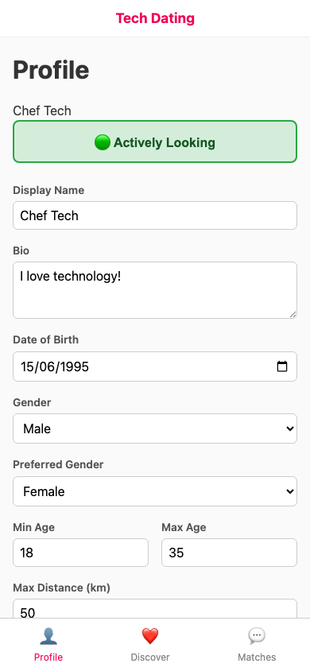 |
| 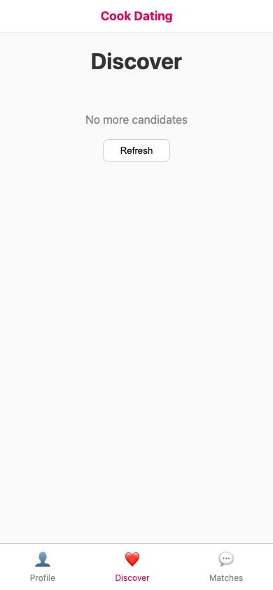 |  |
